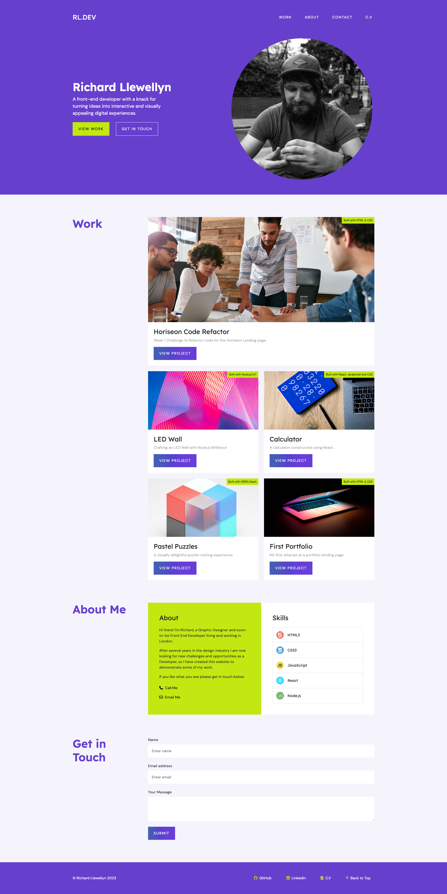

# Bootstrap-Portfolio
Version 2 of my portfolio built using the Bootstrap v5 framework

<!-- TABLE OF CONTENTS -->

  
Table of Contents

  <ol>
    <li>
      <a href="#description">Description</a>
      <ul>
        <li><a href="#built-with">Built With</a></li>
      </ul>
    </li>
    <li>
        <a href="#installation">Installation</a>
    </li>
    <li><a href="#usage">Usage</a></li>
    <li><a href="#license">License</a></li>
    <li><a href="#contact">Contact</a></li>
    <li><a href="#acknowledgments">Acknowledgments</a></li>
  </ol>

<!-- ABOUT THE PROJECT -->
## Description

 
 
This was the 3rd homework challenge for the EDX Bootcamp in Front End Development.
 

   
Our task was re-build our portfolio page from week 2, but this time utilising the Bootstrap Framework.

 

 
For this project I started again from the ground up, using existing Bootstrap components to build the structure of the page, and utilising bootstrap utility classes to reduce the need for much custom overrides. This also enabled me to make the page responsive without writing any of my own media queries.

 

### Built With

* 
* 
* 

## Installation

N/A

<!-- USAGE EXAMPLES -->
## Usage

To use this project, please open the website in Chrome and then use developer tools to view the website using the Device Toolbar, which is the icon of the Laptop and Phone next to the Element Selection tool in the top left corner of the window.

Once the device toolbar is open the user will be able to try out various devices such as iPhones and iPads in portrait and landscape views to see how the website responds on different screen sizes.

Alternatively uses can drag their browser window to resize the screen.

<!-- LICENSE -->
## License

Distributed under the MIT License. See `LICENSE.txt` for more information.

<!-- CONTACT -->
## Contact

Richard Llewellyn - richard.lee.llewellyn@gmail.com 

Project Link: [https://richllew182.github.io/Bootstrap-Portfolio/](https://richllew182.github.io/Bootstrap-Portfolio/)

Project Repo Link: [https://github.com/RichLlew182/Bootstrap-Portfolio](https://github.com/RichLlew182/Bootstrap-Portfolio)

<!-- ACKNOWLEDGMENTS -->
## Acknowledgments

* [Bootstrap](https://getbootstrap.com/docs/5.3/getting-started/introduction/)
* [Unsplash](https://unsplash.com/)
* [Img Shields](https://shields.io)
* [Best README Template](https://github.com/othneildrew/Best-README-Template)

